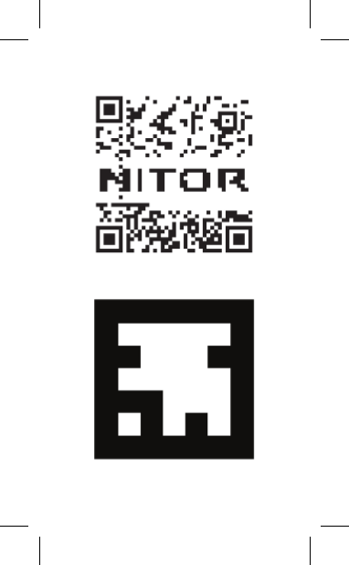

# Nitor Business Card Augmented Reality Demo #

This repository contains the small augmented reality demo that is linked
to some business cards. The code is hosted at https://aur.nitorio.us/
and some business cards have a QR code with the link with the form
https://aur.nitorio.us/?p=name .

The code is a fork of the marker_ar example from https://github.com/buildar/awe.js .
The initial implementation paints a plane on top of the AUR marker with the
picture matching the 'p' query parameter as the texture.

There is a fallback behavior that just adds the picture as a link on the page
after a timeout for browsers that do not support the functionality (iPhones and
Microsoft phones).

Pushing to this repo triggers a build on https://bob.nitorio.us/jenkins/job/aur-sync/
which syncs the files to the backing S3 bucket and triggers an invalidation of
the CloudFront cache.

## Add your own picture ##

You can add your own picture to your business card if you like:

1. Create a jpg image you'd wish to display on top of the AUR marker (square)
and commit it to this repository [name].jpg
1. Create a QR code with the link as above https://aur.nitorio.us/?p=name
    * One option for this is to use this QR code generator http://research.swtch.com/qr/draw
    with for example [this image](nitor-bw.png)
    * It works nicely if you scale the image to match the size of the code and
    select "Data Pixels Only"
    * This works so that the url ends up being https://aur.nitorio.us/?p=name#[really long string of digits to make the image what you want]
    * However you generate your QR the url needs to have a hard-to-guess hash part 
1. Create and commit a file: [50 first characters from your QR url hash].txt with your full name in it (examples in the repo)
1. Print the QR code and the AUR marker for example on the back of your business
card like below
1. If you want links to your twitter feed or linkedIn profile, add the data
for those into the persons -variable in the beginning of [index.html](index.html).

